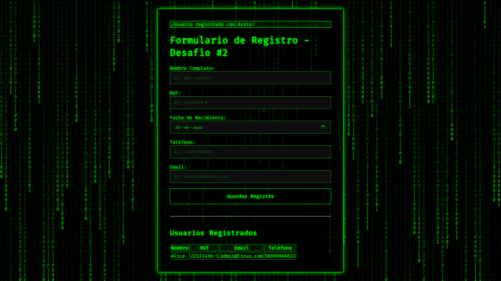

# Reto #2 - Formulario Interactivo (Versión Matrix)

**Autora:** Alice Muñoz



---

## Descripción del Proyecto

Esta es mi solución para el **Desafío #2 del Club Informático - Chile**. El desafío consistía en crear un formulario interactivo con validaciones en tiempo real y una base de datos.

He implementado todas las funcionalidades requeridas y añadido varios extras, incluyendo una completa **doble capa de validación (frontend y backend)** y una **estética "hacker" inmersiva inspirada en Matrix**, con un fondo animado de "lluvia de código" generado con HTML5 Canvas.

---

### ✨ Características Principales

*   **Diseño "Matrix":**
    *   Fondo animado con "lluvia de código" para darle una estética visual más Informática .
    *   Paleta de colores verde sobre negro con efectos de brillo y tipografía monoespaciada.

*   **🔐 Doble Capa de Validación:**
    *   **Frontend:** Validación instantánea en JavaScript que guía al usuario en tiempo real con feedback visual (bordes verdes/rojos).
    *   **Backend:** Segunda capa de validación en Python para garantizar la integridad y seguridad de los datos antes de guardarlos.

*   **🇨🇱 Validación de RUT Chileno Completa:**
    *   Se comprueba tanto el formato (`NN.NNN.NNN-K`) como la validez matemática del dígito verificador, tanto en el cliente como en el servidor.

*   **🗄️ Base de Datos con ORM:**
    *   Los datos se guardan de forma persistente en una base de datos **SQLite**.
    *   La interacción con la base de datos se maneja a través de **Flask-SQLAlchemy**, siguiendo las mejores prácticas de la industria en lugar de escribir SQL directamente.

*   **🏗️ Arquitectura Modular (Application Factory):**
    *   El código está organizado de forma profesional, separando la lógica en modelos (`models.py`), rutas (`routes.py`), validaciones (`valida_rut.py`) y configuración (`__init__.py`).

*   **💬 Feedback Claro al Usuario:**
    *   Uso de mensajes `flash` para notificar al usuario sobre el éxito del registro o sobre errores de validación del backend.
    *   El formulario retiene los datos ingresados si ocurre un error en el servidor, mejorando la experiencia de usuario.

---

### 🛠️ Stack Tecnológico

*   **Backend:** Python 3.12
*   **Framework:** Flask
*   **ORM:** Flask-SQLAlchemy
*   **Frontend:** HTML5, CSS3, JavaScript (ES6)
*   **Animación:** HTML5 Canvas

---

### ⚙️ ¿Cómo Ejecutarlo Localmente?

Para levantar el proyecto en tu máquina local, sigue estos pasos:

1.  **Clona el repositorio:**
    ```bash
    git clone https://github.com/Club-Informatico/Reto-Formulario.git
    ``

2.  **Navega al directorio del proyecto:**
    ```bash
    cd Reto-Formulario/Alice_Munoz
    ```

3.  **Crea un entorno virtual:**
    ```bash
    python3 -m venv venv
    ```

4.  **Activa el entorno virtual:**
    *   En Linux/macOS:
        ```bash
        source venv/bin/activate
        ```
    *   En Windows:
        ```bash
        venv\Scripts\activate
        ```

5.  **Instala las dependencias:**
    ```bash
    pip install -r requirements.txt
    ```

6.  **Ejecuta la aplicación:**
    ```bash
    python app.py
    ```

7.  Abre tu navegador y visita `http://127.0.0.1:5001`.
